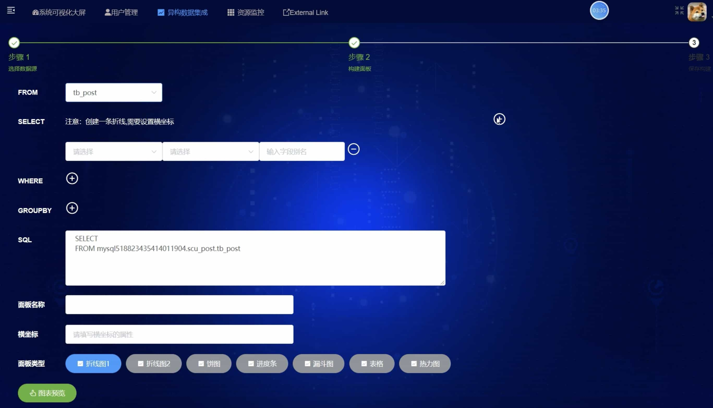

# 微服务数据可视化异构系统（后端）Spring Cloud Hoxton & Alibaba


## 项目简介
“SaaS 企业异构数据集成及应用平台” 是集异构数据集成、数据分析管理、智能资源预警等管控功能的企业数据综合管理系统。

**“软件杯”全国二等奖**

## 项目部署
借助 dockerfile-maven-plugin 实现 docker 镜像的打包，上传镜像之后使用海尔集团提供的 k8s 容器云平台部署。

## 项目亮点
- 完全前后端分离开发，完备的接口文档
- 微服务开发，使用最新的spring-cloud-alibaba 微服务解决方案
- 使用sharding-jdbc实现对数据实现分库分表存放，分布式ID雪花算法保证不会出现重复ID
- 使用分布式presto，一个调度者，两个worker，实现高效查询，不让presto为阻塞系统查询的瓶颈
- 使用非对称加密实现用户鉴权，OAuth2配合JWT实现更加安全的系统，单独的认证服务器，用于令牌（Token）生成和令牌校验，是整个权限系统的核心所在
- 机器学习算法(ARIMA)与深度学习神经网络算法(RNN，LSTM，GRU)并存，用户可以选择自己需要的智能算法或者模型进行预测。
- sentinel实现网站在高并发时候的限流降级熔断
- ELK 实现日志分析
- 整体偏向低耦合与高可用，清晰的模块划分以及完善的异常处理

## 项目文档
系统设计说明书：
https://www.yuque.com/docs/share/d2a67ce6-e4b7-49c9-9a88-ba860013ecaa?# 《系统设计说明书》

用户操作手册：
https://www.yuque.com/docs/share/6206feb3-01bf-4b00-a76e-9f3888cee46c?# 《用户操作手册》

接口设计文档：
https://www.yuque.com/docs/share/effb1505-ae45-479e-aab4-30bdc2d6693f?# 《接口设计文档》

源码文档：
https://www.yuque.com/docs/share/329fb4f1-3e3c-423e-b3b8-2a6a0db2713b?# 《源码文档》

## 项目技术
- Spring Cloud Hoxton & Alibaba：微服务框架
- Spring Boot 2.3：spring容器+MVC+devtools等等
- JWT、Spring Security Oauth2：权限相关
- Sentinel：熔断限流降级 
- Seata：分布式事务(未完成)
- OpenFeign：服务间调用
- RabbitMq：消息队列
- logback：日志持久化
- ELK(Elasticsearch、Logstash、Kibana)：日志分析
- knife4j+swagger：文档工具
- Spring cloud gateway：网关
- MyBatis、pagehelper、MyBatisGenerator、Lombok：数据库操作
- MySql、Redis、MongoDB、influxdb：数据库
- Presto：异构数据源同步

## 项目架构


## 项目结构
```
data-heterogeneous-system
 ├── README.md
 ├── 数据异构系统.drawio 使用draw.io打开
 ├── log 日志文件夹
 ├── pom.xml 父模块pom文件
 ├── sys-sms 短信微服务
 ├── sys-monitors 微服务集群监控
 ├── sys-mybatisgen dao代码生成
 ├── sys-user 用户微服务
 ├── sys-auth 鉴权微服务：
 ├── sys-gateway 网关微服务
 ├── sys-common 通用模块
 └── data-heterogeneous-system.iml idea文件
```

## 系统截图





## 参考链接
https://blog.csdn.net/liukai31415926/article/details/67669123

https://blog.csdn.net/weixin_34015860/article/details/91439856
